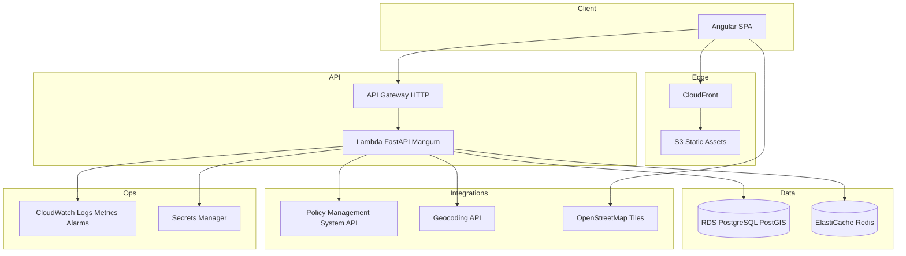
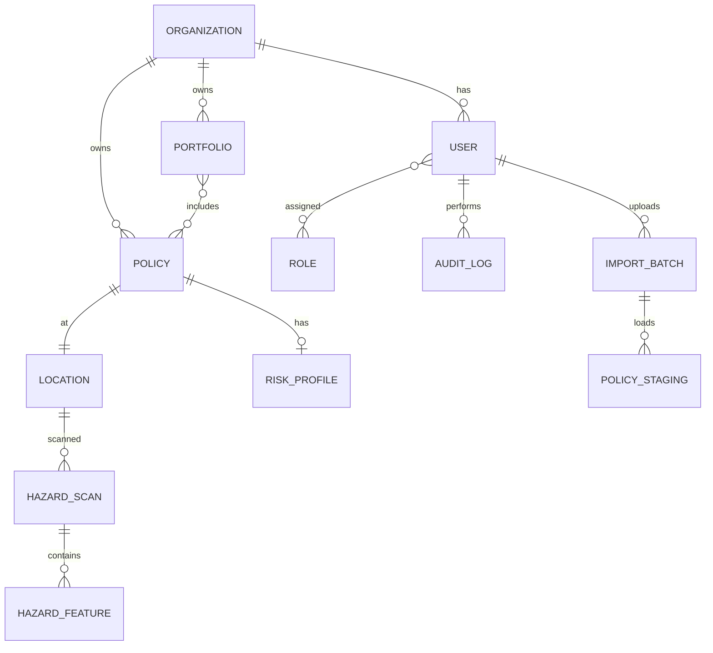
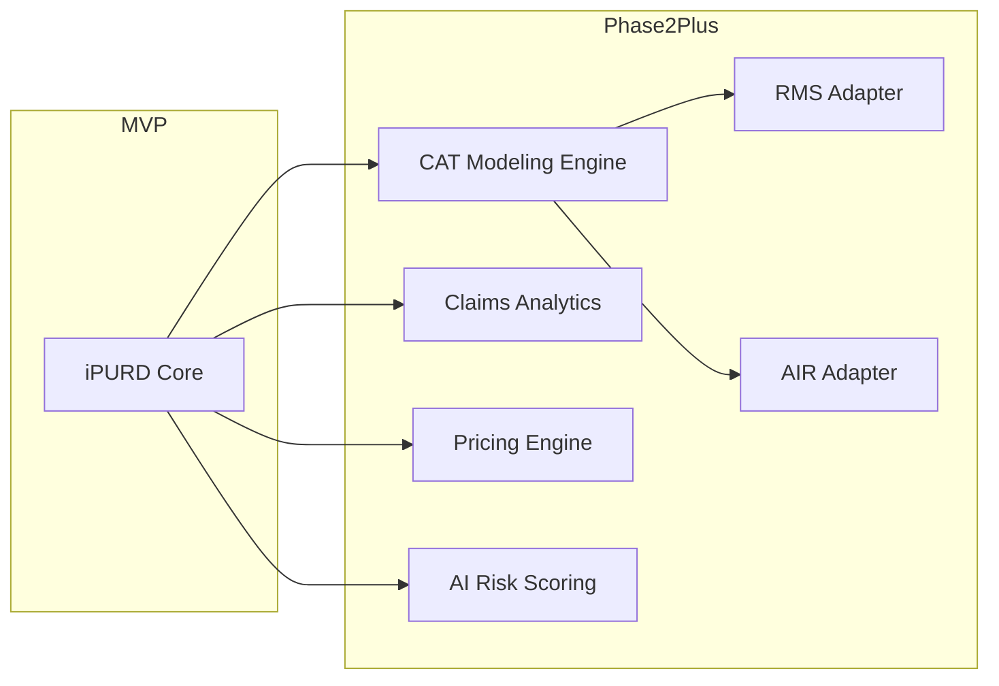

# iPURD — Intelligent Portfolio Underwriting and Risk Dashboard

## Problem

Insurance and reinsurance teams need a single platform to manage insured properties, visualize geographic and catastrophe exposure, run neighbourhood hazard analysis, and understand portfolio accumulation. Today, policy data, geocoding, and risk views are often fragmented across spreadsheets, legacy policy systems, and ad hoc GIS tools. iPURD MVP (Phase 0 + Phase 1) delivers secure multi-tenant infrastructure, policy ingestion with auditability, and an interactive risk dashboard with maps, hazard scans, and executive-ready portfolio views—without CAT modeling or third-party risk vendor integrations in this release.

## In scope

### Phase 0 (Months 1–2)

- **Infrastructure:** AWS dev and prod environments; Docker/Docker Compose local dev; CI/CD (GitHub Actions); CloudWatch monitoring and structured logging; Secrets Manager for credentials.
- **Security:** JWT authentication; RBAC with roles Admin, Underwriter, Risk Analyst, Read Only User; audit trail for data-changing actions.
- **Data management:** Policy import via CSV and Excel upload; validation pipeline; immutable audit log entries for imports and corrections.
- **Integrations (MVP adapters):** Policy Management System (PMS) REST API sync (pull policies by batch/ID); Geocoding API (address → lat/lon, normalized address).

### Phase 1 (Months 3–6)

- **Risk dashboard:** KPIs (total policies, exposure, insured value, risk distribution, exposure by country/city, high-risk assets); risk profile card per policy.
- **Geo intelligence:** Leaflet + OpenStreetMap map; property markers; risk layer overlays; search by address/policy; country/city filters; neighbourhood hazard scan (500 m radius).
- **Hazard scan outputs:** Nearby water bodies, industrial sites, hazard zones; hazard summary, hazard score; flood zone, elevation, terrain risk stored and shown on risk profile.
- **Portfolio accumulation:** Exposure by country, city, region with filters, search, aggregation.
- **Non-functional (MVP targets):** 100k policies; dashboard load &lt; 3s (p95); search &lt; 1s (p95); JWT, RBAC, audit logging; GDPR-ready patterns and DFSA-oriented controls documented in constraints.

## Out of scope

- Phase 2+ CAT modeling, RMS/AIR integrations, claims analytics, pricing engine, AI risk scoring (documented only in Future Phase Design).
- Real-time streaming ingestion (Kafka/Kinesis) beyond batch/API sync.
- Multi-region active-active DR (MVP: single-region with backup/restore runbook).
- Native mobile apps; white-label tenant branding beyond default theme.
- Automated regulatory filing or actuarial sign-off workflows.
- Write-back to external PMS (read/sync in MVP unless explicitly extended).

## Constraints

| Area | Decision |
|------|----------|
| Frontend | Angular 20, Angular Material, RxJS, Leaflet |
| Backend | Python 3.12, FastAPI, SQLAlchemy 2.x, Alembic, Pydantic v2, Mangum on Lambda |
| Data | PostgreSQL 16 + PostGIS 3.x; Redis 7 (ElastiCache) for session/cache/rate limits |
| Cloud | API Gateway (HTTP), Lambda, RDS PostgreSQL, S3, CloudFront, CloudWatch, Secrets Manager |
| Auth | JWT (access + refresh); RBAC enforced server-side on every mutating route |
| Compliance | GDPR-ready: data minimization, retention policies, export/delete hooks for PII; DFSA-aligned access logging and segregation of duties via RBAC |
| Performance | Design for 100k policies; materialized aggregates for dashboard; spatial indexes for map queries |
| Maps | OpenStreetMap tiles (respect usage policy); no proprietary basemap in MVP |
| Geocoding | Pluggable provider (e.g. Nominatim, Google, HERE) via adapter interface; API keys in Secrets Manager |
| Tenancy | Single-tenant deployment per customer in MVP schema (`organization_id` on all business tables for future multi-tenant) |

## Behavior & APIs

High-level behavior is specified in sections 1–10 below. REST contracts in section 4 are the implementation contract; acceptance IDs in **Acceptance** map to sprints in `plan.md`.

---

## 1. System Architecture

### 1.1 High-level architecture



### 1.2 Request flow (authenticated API)

1. User signs in → `POST /api/v1/auth/login` → JWT access (15 min) + refresh (7 days, httpOnly cookie or secure storage per SPA policy).
2. Angular interceptor attaches `Authorization: Bearer <access>`.
3. API Gateway → Lambda (Mangum) → FastAPI middleware: JWT validation, RBAC check, request ID, audit context.
4. Handler uses SQLAlchemy session (RDS); cache-aside for dashboard aggregates and geocode results (Redis, TTL configurable).
5. Spatial queries use PostGIS (`ST_DWithin`, `ST_Intersects`); results serialized as GeoJSON where needed.
6. Errors: RFC 7807-style problem+json; no stack traces in prod responses.

### 1.3 AWS architecture (MVP)

| Layer | Service | Purpose |
|-------|---------|---------|
| DNS/TLS | Route 53 + ACM | `app.<env>.ipurd.example`, `api.<env>.ipurd.example` |
| Frontend | S3 + CloudFront | SPA hosting, OAC to S3 |
| API | API Gateway HTTP v2 + Lambda | REST API, throttling, WAF optional Phase 0 |
| Compute | Lambda (Python 3.12, 512MB–1GB, 30s timeout) | FastAPI via Mangum |
| Database | RDS PostgreSQL Multi-AZ (prod), single-AZ (dev) | PostGIS extension |
| Cache | ElastiCache Redis (single node dev, replica prod) | Sessions, geocode cache, dashboard cache |
| Objects | S3 `ipurd-<env>-uploads` | CSV/XLSX imports, report exports |
| Secrets | Secrets Manager | DB creds, JWT keys, geocode/PMS API keys |
| Observability | CloudWatch Logs, Metrics, Alarms | Lambda errors, RDS CPU, API 5xx |
| Network | VPC (public + private subnets), NAT Gateway | Lambda in VPC for RDS; or RDS Proxy |
| IAM | Least-privilege roles per Lambda, CI OIDC role | No long-lived access keys in repos |

### 1.4 Deployment architecture

| Environment | Purpose | Notes |
|-------------|---------|-------|
| Local | Developer | Docker Compose: Postgres+PostGIS, Redis, API container, optional Angular `ng serve` |
| Dev | Integration | Smaller RDS, single Lambda alias, seed data |
| Prod | Customer | Multi-AZ RDS, reserved concurrency on critical Lambdas, WAF on CloudFront/API |

**Release path:** `feature/*` → PR → `develop` (auto deploy dev) → release PR → `main` (manual approval → prod).

---

## 2. Domain Model

### 2.1 Entity definitions

| Entity | Description | Key attributes |
|--------|-------------|----------------|
| **User** | Platform login identity | `id`, `email`, `password_hash`, `display_name`, `organization_id`, `is_active`, `last_login_at` |
| **Role** | Named permission set | `id`, `code` (`ADMIN`, `UNDERWRITER`, `RISK_ANALYST`, `READ_ONLY`), `name` |
| **UserRole** | Assignment | `user_id`, `role_id` (M:N) |
| **Policy** | Insurance contract / insured risk unit | `id`, `policy_number`, `insured_name`, `occupancy`, `construction`, `sum_insured`, `premium`, `currency`, `status`, `effective_date`, `organization_id`, `pms_external_id` |
| **Location** | Geocoded place for a policy | `id`, `policy_id`, `address_line`, `city`, `country_code`, `postal_code`, `geom` (POINT 4326), `geocode_source`, `geocode_confidence` |
| **RiskProfile** | Computed/stored risk scores per policy | `id`, `policy_id`, `risk_score`, `flood_risk`, `earthquake_risk`, `windstorm_risk`, `flood_zone`, `elevation_m`, `terrain_risk`, `computed_at`, `version` |
| **HazardScan** | Neighbourhood scan run for a location | `id`, `location_id`, `radius_m` (500), `hazard_score`, `summary_json`, `scanned_at`, `status` |
| **HazardFeature** | Individual nearby feature | `id`, `hazard_scan_id`, `feature_type` (`WATER`, `INDUSTRIAL`, `HAZARD_ZONE`), `name`, `distance_m`, `geom` |
| **Portfolio** | Logical grouping (book/segment) | `id`, `name`, `organization_id`, `description` |
| **PortfolioPolicy** | Membership | `portfolio_id`, `policy_id` |
| **Report** | Generated executive artifact | `id`, `type`, `parameters_json`, `s3_key`, `status`, `created_by`, `created_at` |
| **AuditLog** | Immutable audit record | `id`, `actor_user_id`, `action`, `entity_type`, `entity_id`, `before_json`, `after_json`, `ip_address`, `created_at` |
| **ImportBatch** | File upload job | `id`, `filename`, `format`, `status`, `row_count`, `error_summary`, `uploaded_by` |

### 2.2 Relationships (ER narrative)

- `Organization` 1—* `User`, `Policy`, `Portfolio`
- `User` *—* `Role` via `UserRole`
- `Policy` 1—1 `Location` (MVP; future 1—* locations)
- `Policy` 1—0..1 `RiskProfile` (latest by `computed_at`)
- `Location` 1—* `HazardScan`
- `HazardScan` 1—* `HazardFeature`
- `Portfolio` *—* `Policy` via `PortfolioPolicy`
- `User` 1—* `AuditLog` (as actor)
- `ImportBatch` *—* `Policy` (via staging table during import)

### 2.3 ERD (Mermaid)



---

## 3. Database Design

### 3.1 PostgreSQL schema (core tables)

```sql
-- Extensions
CREATE EXTENSION IF NOT EXISTS postgis;
CREATE EXTENSION IF NOT EXISTS "uuid-ossp";

-- organizations (tenant root)
CREATE TABLE organizations (
  id UUID PRIMARY KEY DEFAULT gen_random_uuid(),
  name VARCHAR(255) NOT NULL,
  created_at TIMESTAMPTZ NOT NULL DEFAULT now()
);

-- roles & users
CREATE TABLE roles (
  id UUID PRIMARY KEY DEFAULT gen_random_uuid(),
  code VARCHAR(32) UNIQUE NOT NULL,
  name VARCHAR(128) NOT NULL
);

CREATE TABLE users (
  id UUID PRIMARY KEY DEFAULT gen_random_uuid(),
  organization_id UUID NOT NULL REFERENCES organizations(id),
  email VARCHAR(320) UNIQUE NOT NULL,
  password_hash VARCHAR(255) NOT NULL,
  display_name VARCHAR(255),
  is_active BOOLEAN NOT NULL DEFAULT true,
  last_login_at TIMESTAMPTZ,
  created_at TIMESTAMPTZ NOT NULL DEFAULT now()
);

CREATE TABLE user_roles (
  user_id UUID NOT NULL REFERENCES users(id) ON DELETE CASCADE,
  role_id UUID NOT NULL REFERENCES roles(id),
  PRIMARY KEY (user_id, role_id)
);

-- policies & locations
CREATE TABLE policies (
  id UUID PRIMARY KEY DEFAULT gen_random_uuid(),
  organization_id UUID NOT NULL REFERENCES organizations(id),
  policy_number VARCHAR(64) NOT NULL,
  insured_name VARCHAR(255) NOT NULL,
  occupancy VARCHAR(64),
  construction VARCHAR(64),
  sum_insured NUMERIC(18,2) NOT NULL,
  premium NUMERIC(18,2),
  currency CHAR(3) NOT NULL DEFAULT 'USD',
  status VARCHAR(32) NOT NULL DEFAULT 'ACTIVE',
  effective_date DATE,
  pms_external_id VARCHAR(128),
  created_at TIMESTAMPTZ NOT NULL DEFAULT now(),
  updated_at TIMESTAMPTZ NOT NULL DEFAULT now(),
  UNIQUE (organization_id, policy_number)
);

CREATE TABLE locations (
  id UUID PRIMARY KEY DEFAULT gen_random_uuid(),
  policy_id UUID NOT NULL UNIQUE REFERENCES policies(id) ON DELETE CASCADE,
  address_line TEXT NOT NULL,
  city VARCHAR(128),
  region VARCHAR(128),
  country_code CHAR(2) NOT NULL,
  postal_code VARCHAR(32),
  geom GEOMETRY(POINT, 4326),
  geocode_source VARCHAR(64),
  geocode_confidence NUMERIC(5,4),
  created_at TIMESTAMPTZ NOT NULL DEFAULT now()
);

-- risk & hazards
CREATE TABLE risk_profiles (
  id UUID PRIMARY KEY DEFAULT gen_random_uuid(),
  policy_id UUID NOT NULL REFERENCES policies(id) ON DELETE CASCADE,
  risk_score NUMERIC(5,2),
  flood_risk VARCHAR(32),
  earthquake_risk VARCHAR(32),
  windstorm_risk VARCHAR(32),
  flood_zone VARCHAR(64),
  elevation_m NUMERIC(10,2),
  terrain_risk VARCHAR(32),
  computed_at TIMESTAMPTZ NOT NULL DEFAULT now(),
  version INT NOT NULL DEFAULT 1
);

CREATE TABLE hazard_scans (
  id UUID PRIMARY KEY DEFAULT gen_random_uuid(),
  location_id UUID NOT NULL REFERENCES locations(id) ON DELETE CASCADE,
  radius_m INT NOT NULL DEFAULT 500,
  hazard_score NUMERIC(5,2),
  summary_json JSONB,
  status VARCHAR(32) NOT NULL,
  scanned_at TIMESTAMPTZ NOT NULL DEFAULT now()
);

CREATE TABLE hazard_features (
  id UUID PRIMARY KEY DEFAULT gen_random_uuid(),
  hazard_scan_id UUID NOT NULL REFERENCES hazard_scans(id) ON DELETE CASCADE,
  feature_type VARCHAR(32) NOT NULL,
  name VARCHAR(255),
  distance_m NUMERIC(10,2),
  geom GEOMETRY(GEOMETRY, 4326)
);

-- portfolio & reports
CREATE TABLE portfolios (
  id UUID PRIMARY KEY DEFAULT gen_random_uuid(),
  organization_id UUID NOT NULL REFERENCES organizations(id),
  name VARCHAR(255) NOT NULL,
  description TEXT
);

CREATE TABLE portfolio_policies (
  portfolio_id UUID NOT NULL REFERENCES portfolios(id) ON DELETE CASCADE,
  policy_id UUID NOT NULL REFERENCES policies(id) ON DELETE CASCADE,
  PRIMARY KEY (portfolio_id, policy_id)
);

CREATE TABLE reports (
  id UUID PRIMARY KEY DEFAULT gen_random_uuid(),
  organization_id UUID NOT NULL REFERENCES organizations(id),
  type VARCHAR(64) NOT NULL,
  parameters_json JSONB,
  s3_key VARCHAR(512),
  status VARCHAR(32) NOT NULL,
  created_by UUID REFERENCES users(id),
  created_at TIMESTAMPTZ NOT NULL DEFAULT now()
);

CREATE TABLE audit_logs (
  id UUID PRIMARY KEY DEFAULT gen_random_uuid(),
  organization_id UUID NOT NULL REFERENCES organizations(id),
  actor_user_id UUID REFERENCES users(id),
  action VARCHAR(64) NOT NULL,
  entity_type VARCHAR(64) NOT NULL,
  entity_id UUID,
  before_json JSONB,
  after_json JSONB,
  ip_address INET,
  created_at TIMESTAMPTZ NOT NULL DEFAULT now()
);

CREATE TABLE import_batches (
  id UUID PRIMARY KEY DEFAULT gen_random_uuid(),
  organization_id UUID NOT NULL REFERENCES organizations(id),
  filename VARCHAR(512) NOT NULL,
  format VARCHAR(16) NOT NULL,
  status VARCHAR(32) NOT NULL,
  row_count INT,
  error_summary JSONB,
  uploaded_by UUID REFERENCES users(id),
  created_at TIMESTAMPTZ NOT NULL DEFAULT now()
);
```

### 3.2 PostGIS usage

- All coordinates **EPSG:4326** (WGS84).
- `locations.geom`: property point; **GIST** index.
- `hazard_features.geom`: polygons/lines for overlays; **GIST** index.
- Hazard scan query pattern: `ST_DWithin(l.geom::geography, f.geom::geography, 500)`.
- Country/region aggregation: `country_code`, materialized views with `ST_SnapToGrid` only if clustering map points.
- Reference layers (optional MVP table `hazard_zones`): `geom GEOMETRY(MULTIPOLYGON, 4326)` loaded from curated datasets (flood plains, industrial parks).

### 3.3 Indexing strategy

| Table | Index | Rationale |
|-------|-------|-----------|
| `policies` | `(organization_id, policy_number)` UNIQUE | Lookup |
| `policies` | `(organization_id, country_code)` via join on `locations` | Portfolio filters |
| `locations` | GIST (`geom`) | Map bbox queries |
| `locations` | `(country_code, city)` | Dashboard aggregation |
| `risk_profiles` | `(policy_id, computed_at DESC)` | Latest profile |
| `audit_logs` | `(organization_id, created_at DESC)` | Compliance queries |
| `policies` | GIN full-text on `insured_name`, `policy_number` | Sub-second search |

### 3.4 Partitioning strategy

- **`audit_logs`**: RANGE partition by `created_at` (monthly); retain 7 years per compliance config.
- **`policies`**: LIST partition by `organization_id` when &gt; 1M rows per org (future); MVP single partition.
- **Archival**: cold S3 export for partitions older than retention window.

### 3.5 Materialized views (dashboard performance)

- `mv_exposure_by_country` — `organization_id`, `country_code`, `policy_count`, `total_sum_insured`.
- `mv_exposure_by_city` — adds `city`.
- `mv_exposure_by_region` — adds `region`.
- Refresh: `REFRESH MATERIALIZED VIEW CONCURRENTLY` on schedule (EventBridge → Lambda) and after import batch completion.

---

## 4. API Design

Base path: `/api/v1`. All responses JSON unless file download. Pagination: `?page=1&page_size=50` (max 200). Auth header required except auth routes.

### 4.1 Authentication

| Route | Method | Request | Response | Validation |
|-------|--------|---------|----------|------------|
| `/auth/login` | POST | `{ "email", "password" }` | `{ "access_token", "expires_in", "refresh_token" }` | Email format; rate limit 10/min/IP |
| `/auth/refresh` | POST | `{ "refresh_token" }` | New access token | Valid refresh, not revoked |
| `/auth/logout` | POST | — | `204` | Blacklist refresh in Redis |
| `/auth/me` | GET | — | User + roles | Valid JWT |

### 4.2 Users (Admin)

| Route | Method | Request | Response | Validation |
|-------|--------|---------|----------|------------|
| `/users` | GET | `?role=&q=` | Paginated users | Admin only |
| `/users` | POST | `{ email, display_name, role_codes[] }` | User | Unique email; strong temp password flow |
| `/users/{id}` | PATCH | Partial user | User | Admin; audit |
| `/users/{id}` | DELETE | — | `204` | Soft-delete (`is_active=false`) |

### 4.3 Policies

| Route | Method | Request | Response | Validation |
|-------|--------|---------|----------|------------|
| `/policies` | GET | `?q=&country=&city=&page=` | Policy list + location summary | RBAC read |
| `/policies/{id}` | GET | — | Policy + location + latest risk | RBAC read |
| `/policies` | POST | Policy create body | Policy | Underwriter+; required fields |
| `/policies/{id}` | PATCH | Partial | Policy | Underwriter+; audit |
| `/policies/import` | POST | multipart `file` (csv/xlsx) | `{ import_batch_id }` | DataMgmt role; max 50MB |
| `/policies/import/{batch_id}` | GET | — | Status, errors | RBAC read |
| `/policies/sync/pms` | POST | `{ since?, policy_ids?[] }` | Sync job status | Admin/Underwriter; audit |

**Policy create body (excerpt):** `policy_number`, `insured_name`, `occupancy`, `construction`, `sum_insured`, `premium`, `currency`, `address_line`, `city`, `country_code` — server triggers geocode async if coordinates omitted.

### 4.4 Risk profiles

| Route | Method | Request | Response | Validation |
|-------|--------|---------|----------|------------|
| `/policies/{id}/risk-profile` | GET | — | RiskProfile | Read roles |
| `/policies/{id}/risk-profile/recompute` | POST | — | Job accepted | Risk Analyst+; idempotent queue |

### 4.5 Hazard scan

| Route | Method | Request | Response | Validation |
|-------|--------|---------|----------|------------|
| `/locations/{id}/hazard-scan` | POST | `{ radius_m?: 500 }` | HazardScan (async) | Risk Analyst+ |
| `/hazard-scans/{id}` | GET | — | Scan + features[] | Read roles |
| `/locations/{id}/hazard-scans` | GET | — | History list | Read roles |

### 4.6 Portfolio

| Route | Method | Request | Response | Validation |
|-------|--------|---------|----------|------------|
| `/portfolios` | GET | — | List | Read |
| `/portfolios/{id}/accumulation` | GET | `?group_by=country\|city\|region&filters` | Aggregates + breakdown | Read; uses MVs |
| `/portfolios/{id}/policies` | GET | `?q=&page=` | Policies in portfolio | Read |

### 4.7 Dashboard

| Route | Method | Request | Response | Validation |
|-------|--------|---------|----------|------------|
| `/dashboard/summary` | GET | `?portfolio_id=` | KPIs: totals, distributions, high-risk top N | Cached Redis 60s |
| `/dashboard/exposure-map` | GET | `bbox`, `zoom`, filters | GeoJSON FeatureCollection | bbox required; limit features |

### 4.8 Reports

| Route | Method | Request | Response | Validation |
|-------|--------|---------|----------|------------|
| `/reports` | POST | `{ type: "EXECUTIVE_SUMMARY", parameters }` | Report job | Underwriter+ |
| `/reports/{id}` | GET | — | Metadata + presigned URL when ready | Read |

### 4.9 Map search

| Route | Method | Request | Response | Validation |
|-------|--------|---------|----------|------------|
| `/search/policies` | GET | `q` | Policy hits (≤1s target) | Min 2 chars |
| `/search/addresses` | GET | `q`, `country?` | Geocode suggestions | Rate limited |

### 4.10 Standard error shape

```json
{
  "type": "https://ipurd.example/errors/validation",
  "title": "Validation Error",
  "status": 422,
  "detail": "sum_insured must be positive",
  "instance": "/api/v1/policies",
  "errors": [{ "field": "sum_insured", "message": "..." }]
}
```

### 4.11 RBAC matrix (MVP)

| Capability | Admin | Underwriter | Risk Analyst | Read Only |
|------------|:-----:|:-----------:|:------------:|:---------:|
| User management | ✓ | — | — | — |
| Policy CRUD | ✓ | ✓ | — | — |
| Import / PMS sync | ✓ | ✓ | — | — |
| Hazard scan / recompute | ✓ | — | ✓ | — |
| Dashboard / map / reports | ✓ | ✓ | ✓ | ✓ (read) |
| Audit log view | ✓ | — | ✓ | — |

---

## 5. Angular Application Design

### 5.1 Module structure (standalone components + feature routes)

```
src/app/
  core/           # singletons: auth, interceptors, guards
  shared/         # UI primitives, pipes, directives
  features/
    auth/
    dashboard/
    policies/
    risk-profile/
    map/
    portfolio/
    imports/
    admin/users/
    reports/
```

### 5.2 Routing

| Path | Component | Guard |
|------|-----------|-------|
| `/login` | LoginComponent | Public |
| `/dashboard` | DashboardComponent | Auth |
| `/policies` | PolicyListComponent | Auth |
| `/policies/:id` | PolicyDetailComponent | Auth |
| `/risk/:policyId` | RiskProfileComponent | Auth |
| `/map` | MapExplorerComponent | Auth |
| `/portfolio` | PortfolioAccumulationComponent | Auth |
| `/imports` | ImportWizardComponent | Auth + role |
| `/admin/users` | UserAdminComponent | Admin |
| `/reports` | ReportsComponent | Auth |

### 5.3 Component hierarchy (selected)

- **DashboardFeature**
  - `DashboardPage` → `KpiTiles`, `ExposureChart`, `HighRiskTable`, `RiskDistributionChart`
- **MapFeature**
  - `MapPage` → `LeafletMap`, `MapSearchBar`, `LayerToggle`, `CountryCityFilter`
  - `HazardScanPanel` (side drawer on property select)
- **RiskProfileFeature**
  - `RiskProfilePage` → `PolicyInfoCard`, `LocationCard`, `RiskScoresCard`, `FloodTerrainCard`, `HazardSummaryCard`
- **PortfolioFeature**
  - `PortfolioPage` → `AccumulationFilters`, `RegionTable`, `AggregationChart`

### 5.4 State management

- **Server state:** `@ngrx/signals` or lightweight **RxJS services** with `BehaviorSubject` cache per feature (MVP preference: services + `async` pipe to reduce boilerplate).
- **Auth state:** `AuthStore` (signals): user, roles, token refresh timer.
- **Map state:** ephemeral in `MapFacadeService` (bbox, selected policy, active layers); persist filters in `sessionStorage`.
- **Dashboard:** load via `DashboardService`; stale-while-revalidate from cache headers / service cache.

### 5.5 Shared components

- `DataTable` (Material table + pagination)
- `ConfirmDialog`, `ToastService`
- `FileUploadDropzone` (CSV/XLSX)
- `RiskBadge`, `ExposureFormatter` pipe
- `LoadingOverlay`, `ErrorBanner` (problem+json mapper)

---

## 6. AWS Design

### 6.1 Services used (summary)

See §1.3. Optional additions: **RDS Proxy** (connection pooling to Lambda), **WAF** (OWASP ruleset on CloudFront), **X-Ray** (tracing).

### 6.2 Cost estimate (single-region, monthly, order-of-magnitude)

| Service | Dev | Prod |
|---------|-----|------|
| RDS db.t4g.medium Multi-AZ | — | ~$120–180 |
| ElastiCache cache.t4g.micro | ~$15 | ~$30 |
| Lambda (1M requests, 512MB) | ~$10 | ~$40 |
| API Gateway | ~$5 | ~$20 |
| S3 + CloudFront | ~$5 | ~$25 |
| NAT Gateway | ~$35 | ~$35 |
| CloudWatch | ~$10 | ~$30 |
| Secrets Manager | ~$2 | ~$2 |
| **Total ballpark** | **~$80–100** | **~$280–370** |

*Exclude data transfer, enterprise support, and third-party API fees.*

### 6.3 Networking

- VPC `10.0.0.0/16`: 2 AZs, public subnets (NAT, ALB not required for Lambda), private subnets (RDS, Redis).
- Security groups: Lambda → RDS:5432, Lambda → Redis:6379; no public RDS.
- S3 gateway endpoint optional; VPC endpoints for Secrets Manager/CloudWatch to reduce NAT cost.

### 6.4 Security design

- TLS 1.2+ everywhere; HSTS on CloudFront.
- JWT signing keys in Secrets Manager; rotation runbook.
- IAM: least privilege; GitHub OIDC for CI deploy role.
- Encryption: RDS and S3 SSE-KMS; Redis at-rest encryption.
- S3 bucket policies: deny insecure transport; uploads via presigned POST from API.
- Audit: all mutations → `audit_logs`; CloudWatch metric filters on `ERROR` and `auth.failure`.

### 6.5 Monitoring design

- **Alarms:** Lambda error rate &gt; 1%, API 5xx, RDS CPU &gt; 80%, RDS free storage &lt; 20%, Redis memory &gt; 80%.
- **Dashboards:** CloudWatch dashboard per env (latency p95, invocations, RDS connections).
- **Logs:** structured JSON (request_id, user_id, route, duration_ms); retention 30d dev / 90d prod.

---

## 7. CI/CD Design

### 7.1 Git strategy

- Monorepo: `apps/web`, `apps/api`, `infra/`, `packages/` (optional shared types).
- Conventional Commits; PR required for `develop` and `main`.

### 7.2 Branching

| Branch | Purpose |
|--------|---------|
| `main` | Production releases (tagged `v*`) |
| `develop` | Integration; auto-deploy to dev |
| `feature/*` | Short-lived feature branches |

### 7.3 Build pipeline (GitHub Actions)

1. **Trigger:** PR to `develop` / `main`.
2. **Jobs:** lint (Ruff, ESLint), unit tests (pytest, Karma/Jest), build Docker API image, `ng build --configuration=production`.
3. **Artifacts:** Lambda container image to ECR; Angular `dist/` to S3 (dev workflow on merge to `develop`).

### 7.4 Deployment pipeline

- **Dev:** merge to `develop` → deploy API Lambda alias `dev`, run Alembic migrations, sync S3/CloudFront, invalidate cache.
- **Prod:** merge `develop` → `main` with approval → deploy alias `prod`, migrations with backup snapshot prerequisite.

### 7.5 Rollback strategy

- Lambda: alias weighted rollback to previous version (keep last 3 versions).
- DB: Alembic down only for reversible migrations; forward-fix preferred; pre-deploy RDS snapshot.
- Frontend: redeploy previous S3 object version + CloudFront invalidation.

---

## 8. Development Roadmap (Sprint summary)

Detailed sprint tasks and SF mapping live in **`plan.md`**. Six two-week sprints cover Phase 0 → Phase 1.

| Sprint | Theme |
|--------|-------|
| 1 | Foundation: repo, Docker, DB schema, auth skeleton |
| 2 | Phase 0: RBAC, audit, secrets, CI/CD to dev |
| 3 | Imports, PMS/geocode integrations, policy CRUD API |
| 4 | Dashboard KPIs, materialized views, policy search |
| 5 | Map, Leaflet, hazard scan pipeline |
| 6 | Risk profile UI, portfolio accumulation, reports, perf hardening |

---

## 9. Folder Structure

### 9.1 Angular frontend (`apps/web/`)

```
apps/web/
  angular.json
  package.json
  src/
    app/
      core/
        auth/
        guards/
        interceptors/
        services/
      shared/
        components/
        pipes/
        models/
      features/
        auth/
        dashboard/
        policies/
        risk-profile/
        map/
        portfolio/
        imports/
        admin/
        reports/
    assets/
    environments/
      environment.ts
      environment.prod.ts
    styles/
  public/
```

### 9.2 FastAPI backend (`apps/api/`)

```
apps/api/
  pyproject.toml
  alembic/
    versions/
    env.py
  src/
    ipurd/
      main.py
      config.py
      api/
        v1/
          routers/
            auth.py
            users.py
            policies.py
            risk_profiles.py
            hazard_scan.py
            portfolio.py
            dashboard.py
            reports.py
            search.py
      domain/
        models/
        schemas/
        services/
      infrastructure/
        db/
        redis/
        aws/
        integrations/
          pms/
          geocoding/
      security/
        jwt.py
        rbac.py
      audit/
  tests/
    unit/
    integration/
  Dockerfile
```

### 9.3 Infrastructure (`infra/`)

```
infra/
  terraform/   # or CDK python/
    modules/
      vpc/
      rds/
      lambda/
      api_gateway/
      cloudfront/
      elasticache/
    environments/
      dev/
      prod/
  docker/
    docker-compose.yml
    postgres-init/
```

### 9.4 Database (`database/`)

```
database/
  seeds/
    roles.sql
    demo_organization.sql
  reference_data/
    hazard_layers/README.md
  scripts/
    refresh_materialized_views.sql
```

### 9.5 Tests

```
tests/
  e2e/          # Playwright or Cypress
  load/         # k6 scripts for dashboard/search SLOs
  contract/     # OpenAPI diff
```

---

## 10. Future Phase Design (extension architecture)



| Extension | Integration pattern | Notes |
|-----------|---------------------|-------|
| CAT modeling | Async job queue + worker (ECS/Fargate); store scenarios in `cat_results` | Heavy compute off Lambda |
| RMS / AIR | Vendor API adapters in `integrations/`; normalize to `RiskProfile` + event loss tables | Licensed credentials in Secrets Manager |
| Claims analytics | Warehouse read replica or Snowflake export; BI embed | Read-only from core DB |
| Pricing engine | Rules DSL + versioned rate plans; API `POST /pricing/quote` | Underwriter workflow |
| AI risk scoring | Batch + optional real-time feature store; model registry S3; explainability fields on `RiskProfile` | Human-in-the-loop default |

**Extension principles:** keep domain events (`PolicyImported`, `HazardScanCompleted`, `RiskProfileUpdated`) as internal hooks (SNS/EventBridge) for future decoupling without rewriting MVP modules.

---

## Open questions

- Which **PMS** product and API version is the first customer integration?
- Preferred **geocoding vendor** and licensing for production OSM/Nominatim usage?
- **Single-tenant per deployment** vs shared SaaS multi-tenant for MVP commercial model?
- Source of **flood/hazard zone** reference layers (government open data vs commercial)?
- **Refresh token** delivery: httpOnly cookie vs SPA memory only (CORS/CloudFront implications)?

---

## Acceptance

- **SF-001** — Phase 0: Dev and prod AWS environments provisioned via IaC with VPC, RDS PostGIS, Redis, Lambda, API Gateway, S3, CloudFront, Secrets Manager, and CloudWatch alarms documented in runbooks.
- **SF-002** — JWT login, refresh, logout, and RBAC enforced on all `/api/v1/*` routes per matrix; four roles seeded.
- **SF-003** — CSV and Excel policy import with validation errors per row; `import_batches` and `audit_logs` record uploads and outcomes.
- **SF-004** — PMS sync and geocoding adapters populate `policies` and `locations.geom` for test dataset (≥100 sample policies).
- **SF-005** — Dashboard summary returns KPIs and exposure breakdowns in &lt;3s p95 for 100k policy dataset (materialized views + cache).
- **SF-006** — Policy and address search return results in &lt;1s p95 at 100k scale.
- **SF-007** — Risk profile API and UI show policy, location, risk scores, flood/terrain fields.
- **SF-008** — Map displays markers, risk layers, country/city filters, and policy/address search.
- **SF-009** — Hazard scan within 500m stores water/industrial/hazard features, summary, hazard score, flood zone, elevation, terrain risk on profile.
- **SF-010** — Portfolio accumulation by country, city, region with filters and aggregation matches MV totals.
- **SF-011** — Executive report generation stores artifact in S3 and returns presigned download.
- **SF-012** — CI/CD: `feature/*` → `develop` → `main` pipelines deploy dev/prod with documented rollback.
- **SF-013** — GDPR-ready: export user-related PII endpoint documented; retention job spec for audit/partitions.
- **SF-014** — All mutations produce `audit_logs` entries with actor, action, entity, timestamp.
